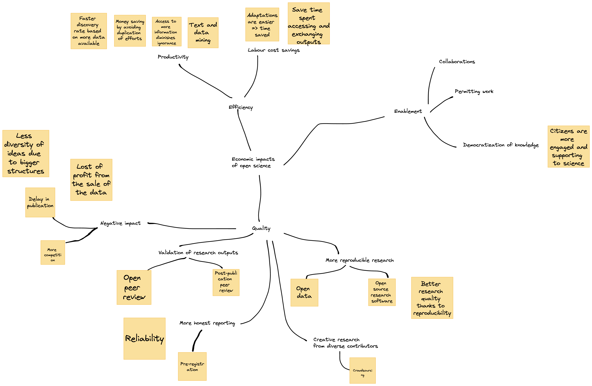

# Content of the course

## Mindmap

40' : create a [collaborative mindmap](https://mymarkmap.vercel.app/#https://raw.githubusercontent.com/Enro/economic-impacts-OS/main/mindmap.md) on the economic impacts of open science

What students produced in 2022 : 

## Case studies

40' : in groups, investigate some case studies of open science outputs and their economic impacts and [fill a template](https://github.com/Enro/economic-impacts-OS/blob/main/template.md)
* [Vidjil](https://www.vidjil.net/) (hematology and immunology)
* ~~[RISC-V](https://riscv.org/) (microprocessor design)~~
* [syringe pump](https://hal.archives-ouvertes.fr/hal-02119548/)
* ~~Landsat satellite images ([source 1](https://www.pnas.org/doi/10.1073/pnas.2001682117) and [source 2](https://www.unoosa.org/pdf/pres/stsc2012/2012ind-05E.pdf))~~
* ~~[PubChem](https://journals.sagepub.com/doi/10.1177/0306312718772086)~~
* [Protein Data Bank](https://dx.doi.org/10.2210/rcsb_pdb/pdb-econ-imp-2017)
* [Human Genome Project](https://web.ornl.gov/sci/techresources/Human_Genome/publicat/BattelleReport2011.pdf)
* [Structural Genomics Consortium](https://www.ncbi.nlm.nih.gov/pmc/articles/PMC5396214/)

20' : break

30' : share the investigations with the other groups

Some groups work:
* on the HGP [https://docs.google.com/document/d/1TtxA5ZoTfP7SIfSUXQgvICsQ4tbjRecJDQLraTlFYS4/edit?tab=t.0#heading=h.8ponywf3r1am](https://docs.google.com/document/d/1TtxA5ZoTfP7SIfSUXQgvICsQ4tbjRecJDQLraTlFYS4/edit?usp=sharing )
* on the Structural Genomics Consortium [https://docs.google.com/document/d/16mlecWRrY_uo5bUkDQaYlS8_P1h-yNkSkXVq5YTskXE/edit?usp=sharing](https://docs.google.com/document/d/16mlecWRrY_uo5bUkDQaYlS8_P1h-yNkSkXVq5YTskXE/edit?usp=sharing)
* on the VidjilNet consortium [https://docs.google.com/document/d/1JJHKJ05GcgVpw__5zypwBOM7BIB-Z3uJRQlQ5EGOjzY/edit?usp=sharing](https://docs.google.com/document/d/1JJHKJ05GcgVpw__5zypwBOM7BIB-Z3uJRQlQ5EGOjzY/edit?usp=sharing)
* syringe pump [https://aixmarseilleuniversite-my.sharepoint.com/:w:/g/personal/el-hadji-ousmane_beye_etu_univ-amu_fr/EeY3sI_tuYBCnK_qsy_7J4sBBbfFmo6473LeqVonWZVuDg?e=is3Aw9](https://aixmarseilleuniversite-my.sharepoint.com/:w:/g/personal/el-hadji-ousmane_beye_etu_univ-amu_fr/EeY3sI_tuYBCnK_qsy_7J4sBBbfFmo6473LeqVonWZVuDg?e=is3Aw9)

## Problem solving

50' : in groups, read through the [IP Policy](https://www.enterprise.cam.ac.uk/wp-content/uploads/2021/04/IP-Policy-in-Practice-Guidance-Note-25May10-FINAL-CLEAN-Updated-links-August-2015.pdf) and the [Open Science Statement]([https://osc.cam.ac.uk/open-research-position-statement](https://web.archive.org/web/20250401023137/https://osc.cam.ac.uk/open-research-position-statement)) of the University of Cambridge.

After studying the texts, identify the institutional barriers of research organizations trying to balance commercialization of research and open science, and explain how you would tackle the issue in your research organization or research lab. [Not everything in the IP Policy and the Open Science statement conflicts with each other](problem-solving.md). So you may mention either things that you have read and could work together, or things that you imagine would work. This is still an open problem so don’t be afraid to speak!

## Bibliography
* European Commission, Directorate-General for Research and Innovation (2022). *Study on factors impeding the productivity of research and the prospects for open science policies to improve the ability of the research and innovation system : final report*, Publications Office of the European Union. https://data.europa.eu/doi/10.2777/58887
* Fell, M. J. (2019). The Economic Impacts of Open Science: A Rapid Evidence Assessment. *Publications*, 7(3), 46. https://doi.org/10.3390/publications7030046
* Hart, K, An, S, Edwards, AM, Mahadevan, R, Master, ER, Edwards, EA. Could open science stimulate industry partnerships in chemical engineering university research? *Can J Chem Eng*. 2021; 99: 2186– 2194. https://doi.org/10.1002/cjce.24077
* Caulfield, T., Harmon, S.H. & Joly, Y (2012). Open science versus commercialization: a modern research conflict?. *Genome Med* 4, 17 (2012). https://doi.org/10.1186/gm316
* Shawn HE Harmon, Timothy Caulfield and Yann Joly (2012). Commercialization versus open science: Making sense of the message(s) in the bottle. *Medical Law International* 12(1), 3-10. https://doi.org/10.1177/0968533212441887
